# 智能客服（AI-CS）

**定位**：面向生产的智能客服后端——有业务流程、治理边界与评估闭环；强调**可观测、可控制、可恢复、可迭代**。

---

## 快速概览

- 面向智能客服场景的生产级 **AI Agent** 后端，覆盖 FAQ、商品咨询、售后处理及人工介入等核心业务流程。
- 基于 **Harness Engineering** 思路，通过 **RAG、语义缓存、流程编排、Memory、Token 预算控制与成本治理、限流降级、分层回放与可观测体系**，系统性治理 AI 应用中的不确定性。
- 聚焦 **质量、成本、性能与风险控制**，体现 AI Agent 在真实生产场景中的工程化落地能力。

## 背景与目标

| 维度 | 内容 |
|------|------|
| **业务痛点** | 纯 LLM 方案难控成本与延迟；RAG/Memory/Tool 叠加后故障难定位；高风险动作需要合规与人审。 |
| **本项目解决** | 用 **Harness Engineering** 把不确定性收口为可运营问题：意图分支、策略与降级、Checkpoint + HITL、指标与离线回放归因。 |
| **目标 SLO（示例）** | **质量**：核心链路成功率 > 85%，高风险场景必须进入 `NEED_HUMAN` 闭环；**性能**：`/chat` p95 < 5s，5xx < 1%；**成本**：单会话成本可解释，重复问题优先走缓存与低成本路径。 |

---

## 核心设计原则

- **Bounded Autonomy**：模型负责生成与判断，但不拥有无限执行权；高风险动作必须经过策略和人工门控。
- **Retrieval-First**：优先从知识库、记忆、业务规则中取证，减少“直接拍脑袋生成”。
- **Structured Tool Contract**：工具调用必须结构化、可校验、可审计，避免自由文本直接驱动副作用。
- **Checkpoint + Idempotency**：长链路任务支持暂停、恢复、回退；副作用调用必须可幂等，避免重复执行。
- **Cost-Aware Routing**：根据任务复杂度、token 预算和模型成本动态选择路径，而不是默认最贵链路。
- **Eval-as-Gate**：离线回放、对比评测与线上观测共同组成变更门禁，避免“改了就上”。
- **Observability-by-Default**：请求、阶段、缓存、RAG、工具、人工介入都默认带 trace / metrics / structured logs。
- **Fail-Soft / Graceful Degradation**：依赖异常时优先降级服务能力，而不是整条链路直接不可用。
- **Version Everything**：模型、Prompt、检索器、知识库、策略都显式版本化，方便回放、归因和回滚。

---

## 架构与模块

| Harness 模块协同（图1） | 意图驱动业务流（图2） |
|:---:|:---:|
| 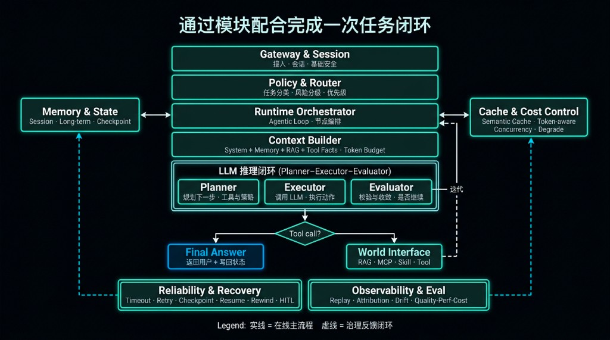 | 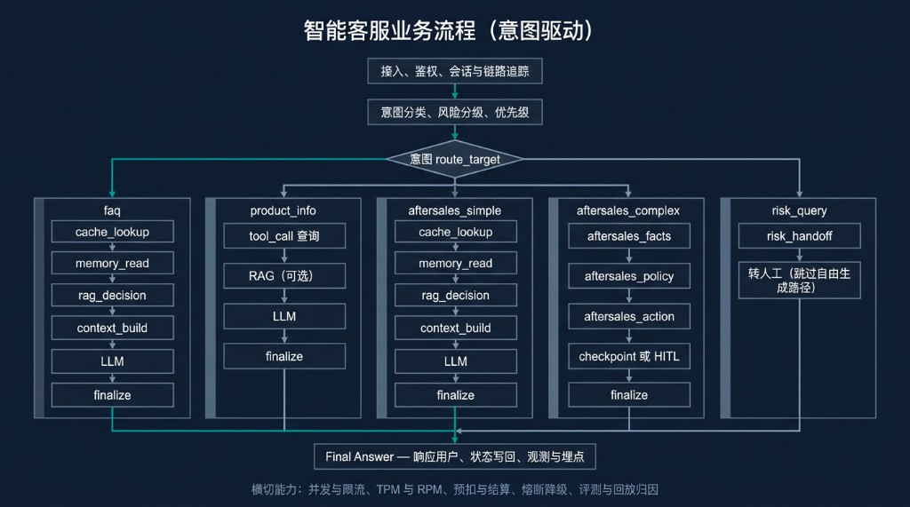 |

### 模块一览

| 模块 | 目录 / 入口 | 职责 |
|------|----------------|------|
| Gateway & Session | `app/api/routes_chat.py` | 接入、限流/并发闸、注入检测、指标、工作流入口 |
| Policy & Runtime | `app/stability/runtime_policy.py` | 路由分桶、优先级、**L0/L1/L2** 降级 |
| Orchestrator | `app/graph/workflows/minimal_chat.py` | LangGraph 式编排、意图分支、工具/MCP、**Checkpoint / HITL** |
| Context Builder | `app/memory/context_builder.py` | Token 预算下拼装 policy / RAG / memory / tool |
| RAG & World | `app/rag/`，`app/mcp_mock/`，`app/skills/` | 混合检索、（Mock）副作用工具、业务技能 |
| Cache & Cost | `app/cache/` | 精确/语义缓存、embedding 运行时 |
| Memory & State | `app/memory/` | 会话/长期记忆、写入门禁 |
| Observability | `app/main.py`，`app/api/routes_chat.py` | JSON 访问日志、`/metrics`、可选 LangSmith |
| Replay / Eval | `scripts/run_layered_replay.py` 等 | 分层回放、归因报告、检索对比 |

---

## 技术栈

| 类别 | 选型 |
|------|------|
| 语言 / 框架 | Python 3.11+、**FastAPI**、**Uvicorn** |
| 编排 | **LangGraph** |
| LLM / Embedding | **LiteLLM** + **Ollama** + **LlamaIndex**<br/>LLM：本地 `ollama/qwen2.5:0.5b`，云端 `openai/qwen-turbo`<br/>Embedding：本地 `sentence-transformers/paraphrase-multilingual-MiniLM-L12-v2`，云端 `openai/text-embedding-v3` |
| 存储 | **Postgres + pgvector**、**Redis** |
| 观测 | **Prometheus**（`/metrics`）、**Grafana**（仪表盘 JSON）、可选 **LangSmith** |
| 部署 | Docker Compose（`deploy/docker-compose.yml`） |

**Harness Engineering 核心点**：以 **RAG、Semantic Cache、Context Engineering、流程编排、Memory 管理** 为能力底座；以 **成本控制、限流降级、Checkpoint、版本控制、分层回放、可观测性** 作为治理抓手。

依赖见 [`requirements.txt`](requirements.txt)。

## 关键技术（按 QCP）

下面按 **质量 / 成本 / 性能** 三个方向，概括项目里最关键的工程问题与对应解法。

### 质量（Quality）

| 问题 | 怎么解决 |
|------|------|
| 参数多、层间耦合，最终答案漂移时容易盲调 | 用 **分层回放** 拆成 `route/cache/rag/final` 多层快照，定位 `first_drift_layer`；先收敛上游，再调下游。 |
| 检索噪声会放大到生成层 | 用 **Hybrid RAG**（`pgvector + 全文检索`）做混合召回，并保留 chunk / 引用 / 版本信息，便于解释与回放。 |
| 上下文来源多，质量不稳定 | 用 **Context Engineering** 在 `policy / memory / RAG / tool facts` 间做预算化拼装，而不是无上限堆 token。 |
| 多步 Agent 容易在高风险动作上出错 | 用 **流程编排 + HITL**，复杂售后走 `facts → policy → action`，在关键节点 `checkpoint + NEED_HUMAN`。 |

### 成本（Cost）

| 问题 | 怎么解决 |
|------|------|
| 重复问题反复走完整链路，token 与检索成本过高 | 用 **Semantic Cache** 做语义级短路，结合版本隔离避免“省钱但答错”。 |
| 长上下文和多轮记忆会推高 token 成本 | 用 **Memory 管理 + 上下文预算**，把长期记忆外置化、把 session 压缩成可控摘要。 |
| 不同任务复杂度差异大，默认走大模型会浪费预算 | 用 **Cost-Aware Routing**，支持本地 / 云端模型切换、fallback 与不同路径选择。 |
| 模型、Prompt、知识库一改，缓存和评测基线就会失效 | 做 **全流程版本控制**，把 `model/prompt/kb/policy/tool contract` 带进缓存键、回放标签与调参基线。 |

### 性能（Performance）

| 问题 | 怎么解决 |
|------|------|
| AI 链路不仅有 QPS，还有 TPM/RPM、工具尾延迟和在途请求压力 | 用 **优先级 + 限流 + 并发闸**，在入口层控制 inflight、RPM/TPM 与不同路由桶的负载。 |
| 依赖异常时整条链路容易不可用 | 用 **稳定性保障**：分层超时、重试、退避、L0/L1/L2 降级，必要时缩短链路或模板兜底。 |
| 长任务失败后全量重跑代价高 | 用 **Workflow Checkpoint / Resume / Rewind**，让链路可以从中间恢复，而不是每次从头执行。 |
| 性能瓶颈难定位 | 用 **可观测性** 把成功率、p95、缓存、RAG、工作流阶段、Tracing 串起来，形成可定位的证据链。 |

---

## 功能概览与 Demo 截图

**能力**：意图路由（faq / product_info / aftersales / risk_query 等）、混合检索与可选重排、多级缓存与记忆、运行时降级与分层超时、复杂售后 **HITL + 回退**、Prompt 防护与输出护栏、Prometheus 指标与分层回放评测、内置 **Demo UI**。

**Demo UI**：`http://127.0.0.1:8000/demo/agent-console`（启动 API 后打开）。

| 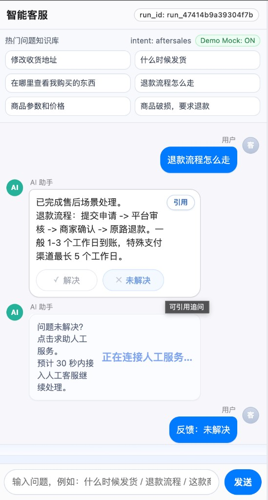 | 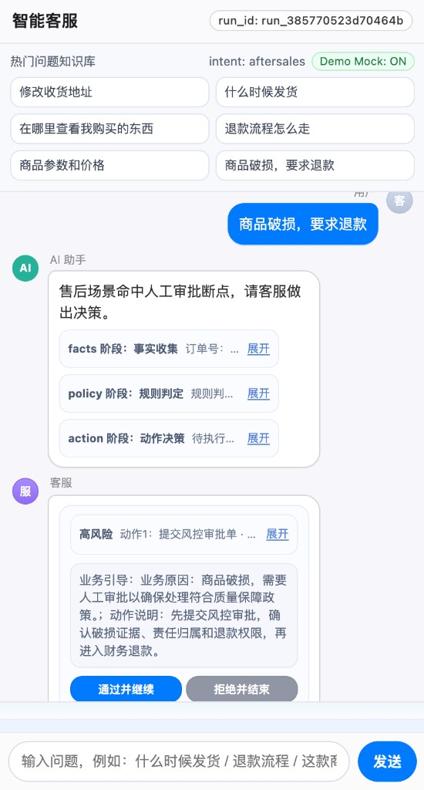 | 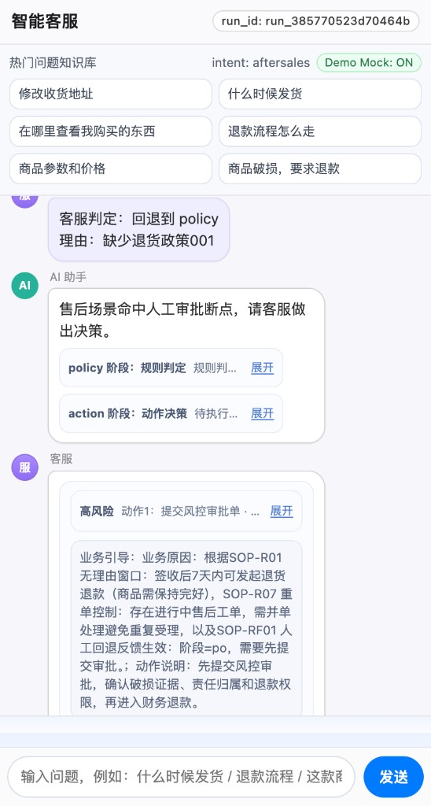 |
|:---:|:---:|:---:|
| 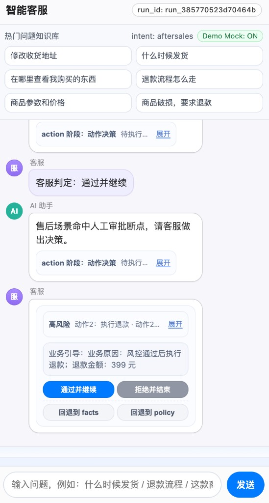 | 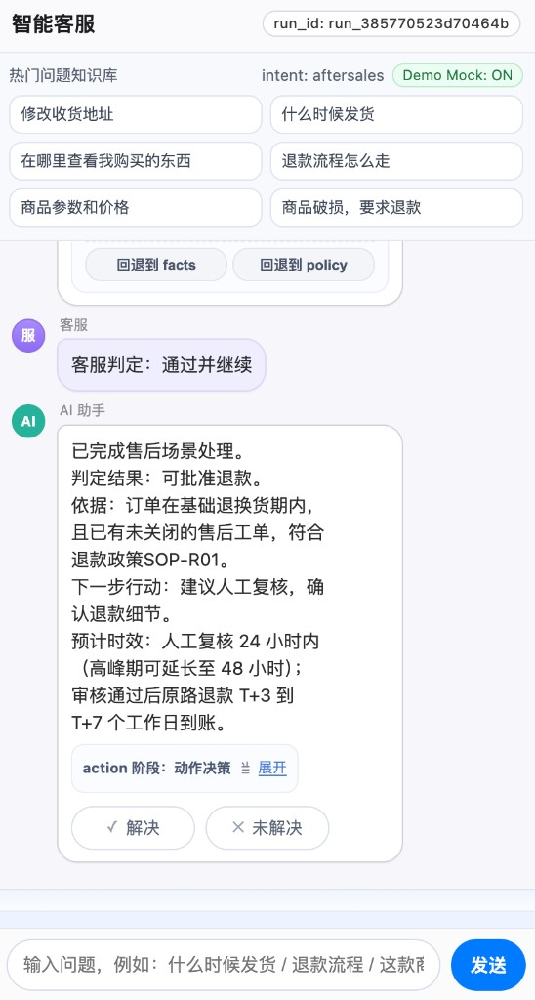 | 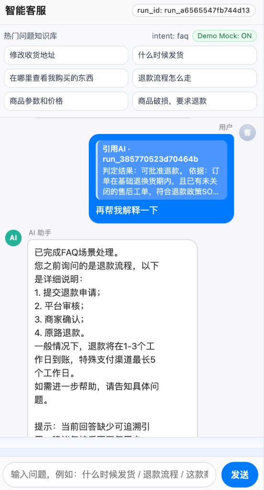 |

---

## 可观测性 + Eval + Tracing

**运行时重点指标（节选）**：成功率、**p95**、限流/降级次数、RAG 耗时、LLM 调用量与延迟、缓存命中、工作流阶段与 **NEED_HUMAN** 闭环相关计数。

**实现**：业务指标在 `app/api/routes_chat.py`；HTTP 壳与访问日志在 `app/main.py`；Grafana 面板在 `deploy/grafana/dashboards/`（如 `memory_observability.json`、`core_ops_business_kpi.json`）。**详细说明**见 [`docs/observability.md`](docs/observability.md)。

本地：`docker compose -f deploy/docker-compose.yml --profile obs up -d` → Grafana / Prometheus；`curl -s http://127.0.0.1:8000/metrics`。

**LangSmith**：Dataset 评测（`scripts/run_langsmith_eval.py`）与 **Tracing**（`ENABLE_LANGSMITH=true` + 项目 `LANGSMITH_PROJECT`）。若控制台提示 **配额/计费**，Experiment 可能可见但 **Tracing 列表为空**，详见 [`docs/observability.md`](docs/observability.md)。

| 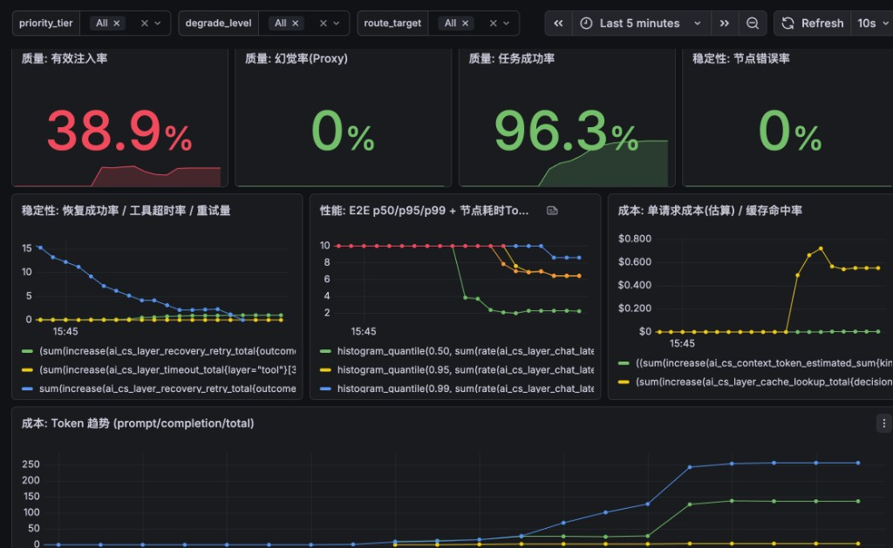 | 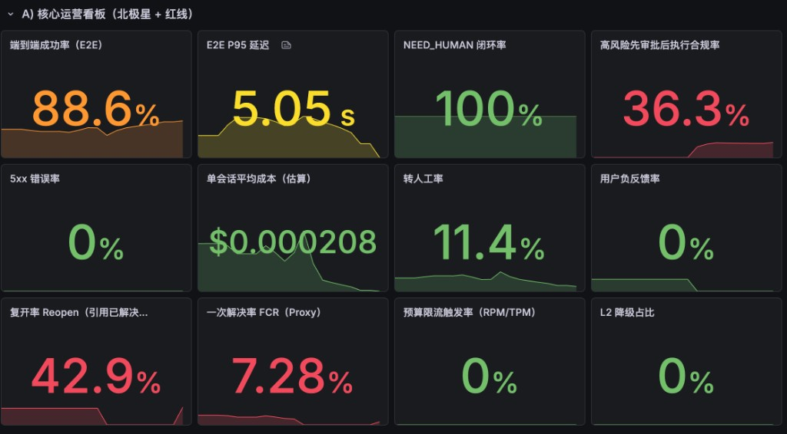 | 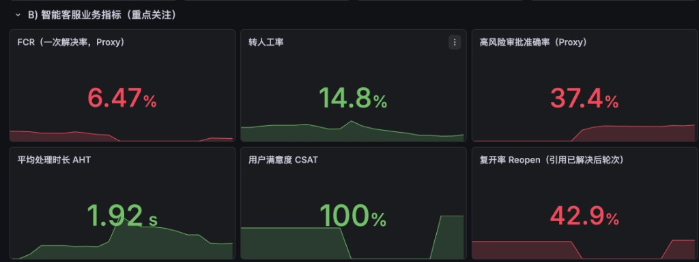 |

**LangSmith Evaluation（示例：`dashboard_coverage_v1`）**：

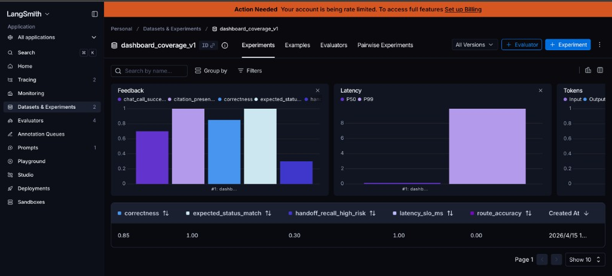

**LangSmith Tracing（示例：`chat_workflow` 单次链路）**：

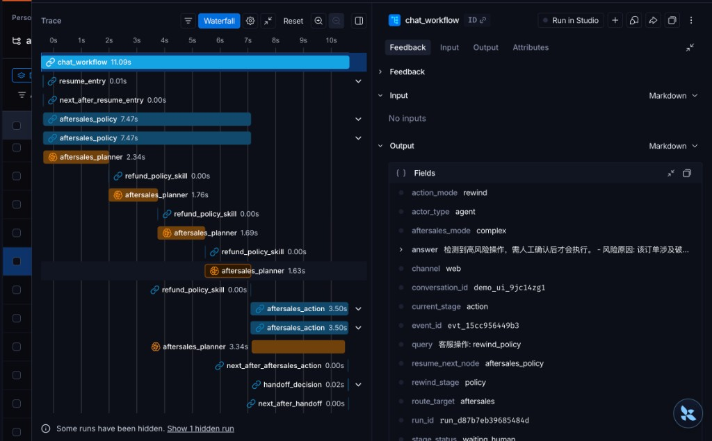

**日志结构**：运行时日志可分三层：
- **入口层**：HTTP 访问日志，定位 `trace_id`、状态码、耗时。
- **异常层**：未捕获异常日志，定位错误路径与报错文本。
- **响应调试层**：`/chat` 返回体中的 `debug`，用于解释路由、RAG、缓存、工作流阶段、人工介入点等。

<details>
<summary>展开查看日志结构示例与各 section 说明</summary>

```json
{
  "http_access": {
    "type": "http_access",
    "trace_id": "3f5c2c6b-7d8e-4f9a-a123-xxxx",
    "method": "POST",
    "path": "/chat",
    "status_code": 200,
    "latency_ms": 1842.31
  },
  "unhandled_exception": {
    "type": "unhandled_exception",
    "trace_id": "3f5c2c6b-7d8e-4f9a-a123-xxxx",
    "path": "/chat",
    "error": "..."
  },
  "chat_debug_sections": {
    "prompt_injection": { "hit": false, "action": "none" },
    "cache": { "hit": false, "decision": "miss" },
    "memory": { "hit": true, "context_debug": { "selected_count": 2 } },
    "rag": { "need": true, "retrieved_count": 3 },
    "context": { "llm_context_chars": 1180 },
    "run_step_summary": {
      "brief": "route=aftersales -> policy -> action -> wait_human",
      "current_path": { "stage": "action", "pending_action": "approval_submit_mcp" }
    },
    "aftersales_agent": {
      "trace": [
        { "stage": "facts", "status": "ok" },
        { "stage": "policy", "status": "ok" },
        { "stage": "action", "status": "wait_human_before_mcp" }
      ]
    },
    "guardrail": { "action": "pass", "sensitive_hits": [] },
    "dependency_probe": { "redis": "ok", "postgres": "ok" }
  }
}
```

**各 section 说明**：
- `http_access`：入口请求壳日志；适合先看成功率、路径、RT，并用 `trace_id` 串联后续日志/Tracing。
- `unhandled_exception`：兜底异常日志；线上排障优先看这里是否存在同 `trace_id` 的报错。
- `prompt_injection`：注入检测结果与动作（拦截/清洗/放行）。
- `cache`：缓存命中、旁路或回填决策。
- `memory`：记忆是否命中、注入条数、上下文选中情况。
- `rag`：是否触发检索、召回条数、引用相关调试信息。
- `context`：上下文长度、预算裁剪等与 token 成本直接相关的信息。
- `run_step_summary`：面向展示的工作流摘要，快速说明当前路径、阶段与待处理动作。
- `aftersales_agent.trace`：复杂售后链路的细粒度阶段轨迹，如 `facts / policy / action / wait_human`。
- `guardrail`：输出护栏结果，包括敏感信息、引用约束等。
- `dependency_probe`：依赖健康快照，如 Redis / Postgres / 外部模型服务状态。

</details>

**响应 `debug` 结构（概要）**与流程总览：[`docs/project-detail.md`](docs/project-detail.md)。

---

## 归因与调参（分层回放）

**原理**：把一次回答拆成可对比层次，用 **first_drift_layer** 定位首漂移层，避免跨层盲调。

**实现**：这是一个“**采集 → 回放对比 → 归因报告**”的闭环。先用 `run_layered_replay.py collect` 走真实 `/chat`，把每条请求沉淀成一条 `replay_case` 和多条 `replay_snapshot`；其中 `replay_case` 记录“这条样本是什么”，`replay_snapshot` 记录“每一层输出了什么、用了哪些参数、关键指标是多少”。

对比阶段再把 `baseline_tag` 和 `candidate_tag` 的同 query 样本配对，按 **L1 → L2 → L3 → L4** 逐层判断一致性，写入 `replay_diff`，并归档一次 `replay_experiment`。某条样本里**第一处不一致的层**就是 `first_drift_layer`；如果所有层都一致，则记为 `none`。

分成两种视角来讲：
- `observe`：看真实全链路联动后的首漂移，回答“线上整体为什么变了”。
- `isolate`：从目标层开始看漂移，尽量屏蔽上游影响，回答“具体是这一层自己变了，还是被上游带偏了”。

指标：`route_match` / `cache_match` / `rag_match` / `final_match`（0/1）、`drift_distribution`（首漂移层分布）、`cases`（有效样本数）。`layered_replay_report.py` 会进一步汇总 observe + isolate，给出主漂移层占比、层一致率，以及下一步参数建议。比如这批样本如果主要漂在 **L4**，那我会优先回看模型、Prompt 或上下文预算，而不是先怀疑检索。

**一句话闭环**：对同一批 query，把 baseline 和 candidate 的分层快照逐层对比，先找“第一处变化发生在哪层”，再围绕这一层做下一轮调参，而不是全链路盲改。

**命令与调参闭环（详细步骤）**：[`docs/layered-replay-guide.md`](docs/layered-replay-guide.md)。

---

## 主要数据表

下面列的是项目里用于 **RAG、缓存、Memory、工作流恢复、分层回放** 的核心表，按功能分组展示其主要作用。

### RAG

| 表名 | 主要作用 |
|------|------|
| `kb_chunks` | 知识库分块主表，存放 chunk 文本、来源信息、全文检索字段、云端/本地向量、`kb_version`、`policy_version` 等，是 Hybrid RAG 的核心数据源。 |

### Cache

| 表名 | 主要作用 |
|------|------|
| `semantic_cache_entries` | 语义缓存持久化表，保存 query、answer、引用、source doc/chunk、版本信息与缓存向量，用于重复问题短路、降低 RT 与 token 成本。 |

### Memory

| 表名 | 主要作用 |
|------|------|
| `memory_items` | 记忆主表，存储 short / long / l3 memory、本体内容、摘要、重要度、准入结果、引用与向量，用于长期上下文注入。 |
| `memory_events` | 记忆事件表，记录记忆读写过程中的事件、状态、错误与耗时，便于排查 memory 写入或召回异常。 |
| `session_memories` | 会话摘要表，维护 recent turns、rolling summary、turn_count 等，作为 session 级上下文压缩与续聊载体。 |

### Workflow / Recovery

| 表名 | 主要作用 |
|------|------|
| `workflow_checkpoints` | 工作流 checkpoint 表，保存 `thread_id` / `run_id` / `node_name` / `state_json` 等，用于 `continue / rewind / NEED_HUMAN` 等恢复路径。 |

### 分层回放 / 归因

| 表名 | 主要作用 |
|------|------|
| `replay_case` | 分层回放样本主表，保存输入、期望输出、场景标签、环境信息，定义“这条样本是什么”。 |
| `replay_snapshot` | 分层快照表，按 layer 保存输入/输出/决策/参数/指标，用于判断每一层是否一致。 |
| `replay_experiment` | 回放实验主表，记录 baseline / candidate、实验模式与全局参数。 |
| `replay_diff` | 差异结果表，记录 `first_drift_layer`、各层 diff 汇总与严重级别，是归因报告的核心落点。 |

> 这些表的建表逻辑分散在 `deploy/postgres/init.sql`、`app/rag/hybrid_retriever.py`、`app/memory/store.py`、`app/cache/l2_persist_pg_store.py`、`app/graph/checkpoint_store.py` 等文件中。

---

## 快速开始

**[`docs/quickstart.md`](docs/quickstart.md)**（环境、`.env`、`docker compose`、健康检查、`/metrics`、Demo 链接）。

---

## Runbook

**[`docs/runbook.md`](docs/runbook.md)**（常见问题、降级入口、排障顺序）。

---

## 局限与规划

- **演示与真实生产**仍有差距：部分外部系统为 **Mock**，多租户计费与合规需继续产品化。  
- **质量指标**依赖评测集与业务标注；需持续扩充长尾与边界场景。  
- **工程化**：CI 门禁、发布前 replay、告警规则与 On-call 文档可继续补齐。

---

## 许可证

未指定开源许可证；默认**仅供学习/面试展示**，请勿视为可直接用于生产的授权软件。
